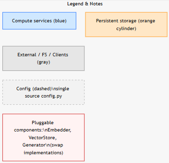
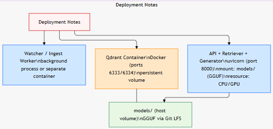
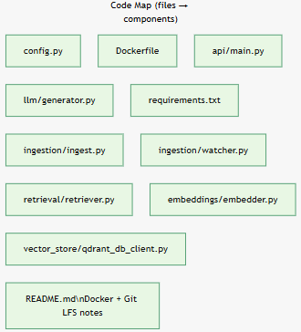
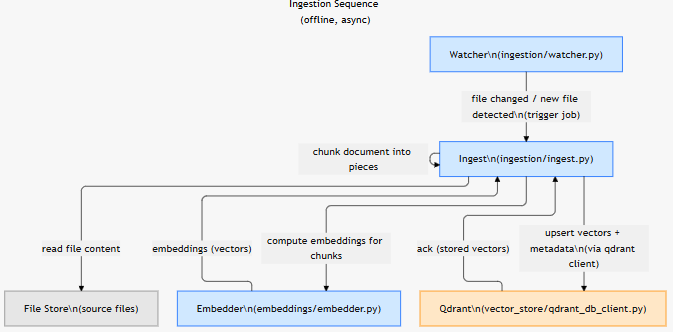
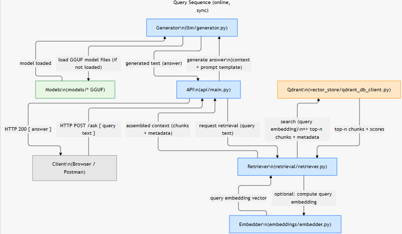
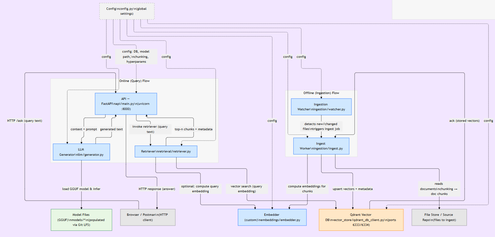

# multi-file-rag

The project is a multi-file RAG (Retrieval-Augmented Generation) system built with Python, designed to process documents and answer queries using a large language model (LLM). The workflow begins with ingestion: a watcher process detects changes to source files, triggering an ingestion pipeline that reads the files, computes embeddings for their content, and stores the resulting vectors and metadata in a Qdrant vector database. This process is handled by components like ingestion/watcher.py and ingestion/ingest.py. For querying, a FastAPI server (api/main.py) receives HTTP requests, which are processed by a generator (llm/generator.py) to produce answers. The generator relies on a retrieval component (retriever/retriever.py) that uses the Qdrant database to find relevant document chunks based on a query's embedding. The system is containerized with Docker, and its architecture is documented in a series of diagrams showing the deployment, code structure, and data flow for both ingestion and query sequences.

Walk through youtube link: https://youtu.be/vb7nWpVhabc

### To build docker image for Qdrant DB run:

- `INSTALL DOCKER IN YOUR COMPUTER`

Run this below command to build the image:

`docker build -t my-qdrant-db .`

Run this below command to run the container:

`docker run -d -p 6333:6333 -p 6334:6334 my-qdrant-db`

### To Load and save model in `model` directory:

Install Git LFS (Large File Storage)

- `git lfs install`

Run this to download the model, here: `Meta-Llama-3-8B-GGUF`

- `git clone https://huggingface.co/QuantFactory/Meta-Llama-3-8B-Instruct-GGUF`

- This will create a folder Meta-Llama-3-8B-GGUF with multiple .gguf files (different quantizations like Q4, Q5, Q8)

- Pick the quantization you want (for local use, Q4_K_M is a good balance)

Copy the model into models
- `copy Meta-Llama-3-8B-GGUF\llama-3-8b.Q4_K_M.gguf models\`

### DOCUMENT: https://huggingface.co/QuantFactory/Meta-Llama-3-8B-Instruct-GGUF

For NOW lets download **Q4_K_M** for a good balance: https://huggingface.co/QuantFactory/Meta-Llama-3-8B-Instruct-GGUF/resolve/main/Meta-Llama-3-8B-Instruct.Q4_K_M.gguf

### FOR ANY ISSUE IN DOWNLOADING THE MODEL, REFER THE HUGGING FACE *DOCUMENT*

### llm model link: https://drive.google.com/file/d/1NQCB9rgcKClzkwTBHWbHCZYGB_7bpITc/view?usp=sharing
(save the same in the model directory)

## To run the pipeline (watcher):
`python config.py`

## To run the FAST API:
`uvicorn api.main:app --reload`

### Open browser:
`http://127.0.0.1:8000/docs`

## On uploading or changes in the file in the document directory, RAG implementaion can be viewed

### API Call (Browser or Postman):
Example query: `http://127.0.0.1:8000/ask?query=what is the synopsis about`

## To scrap urls from the page

### Give executable permission
`chmod +x crawl_links.sh`

### Useage
`./crawl_links.sh <url>`

while the watcher/pipeline is running (to detect file change)

